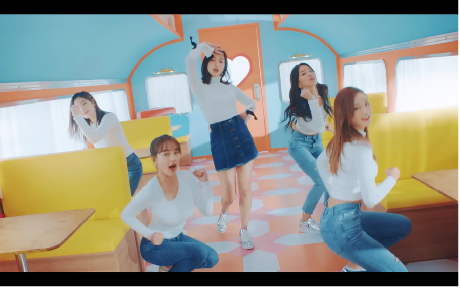
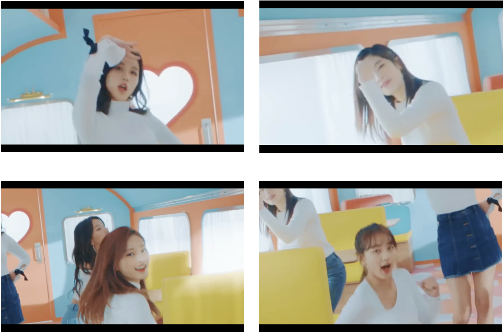
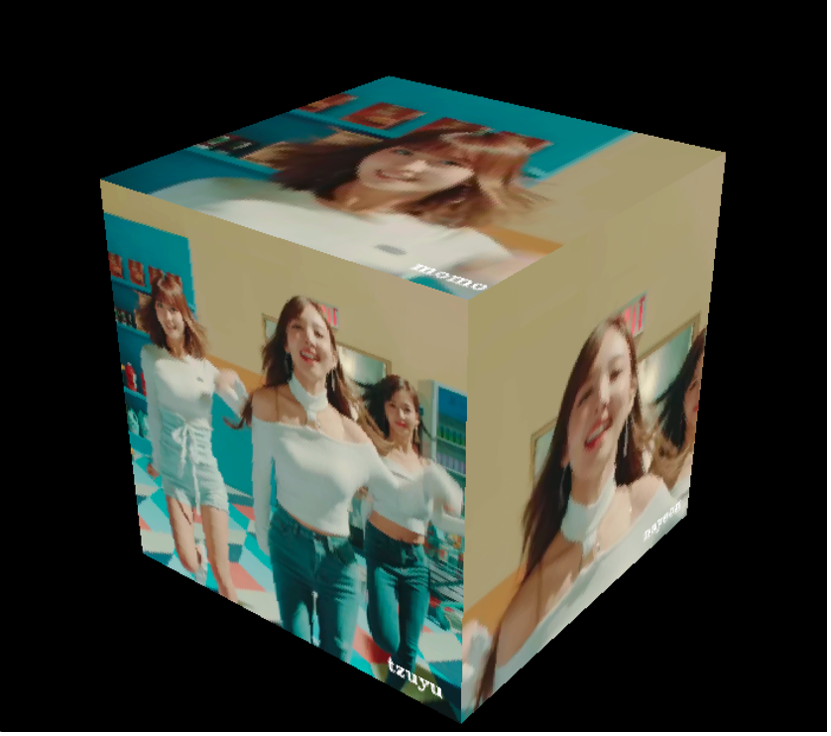
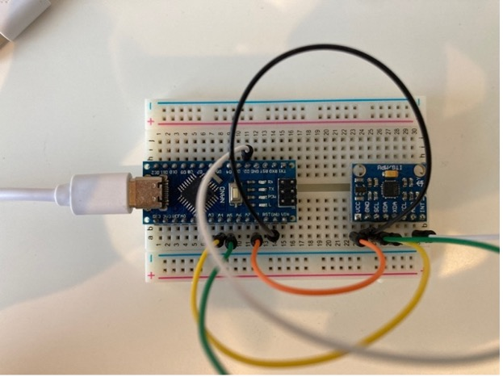

# SyncCube 制作レポート

---

## 概要

**SyncCube** は、ミュージックビデオ（MV）からメンバーごとのフォーカス映像を自動生成し、  
それを**立方体の6面に投影してリアルタイム回転再生**するシステムである。  
姿勢センサー（マイコン）から取得した Roll / Pitch / Yaw に応じて視点を動かし、  
音声も同期再生する。

この制作は以下の3つの技術要素を組み合わせている：

- 機械学習による **顔認識・人物追跡**
- **3Dコンピュータグラフィックス（OpenGL）** による立方体映像表示
- **加速度センサー（6軸IMU）との同期制御**

---

## 動機

私は日常的に K-POP グループ **TWICE** のミュージックビデオをよく鑑賞しており、  
9人いるメンバーの中で特に「推し」のメンバーを常に追って見たいと感じていた。  
しかし、MVではメンバーの出番が限られており、**推しを中心に見続けるのが難しい**。

そこで、  
> 「MVを自動的に“推し中心”に変換できたら面白いのでは」

という発想からこの制作を始めた。

さらに、単に映像を切り出すだけでなく、  
**まるでライブステージを鑑賞しているような臨場感**を得るために、  
各メンバー映像を立方体の面に貼り付けて、  
**姿勢センサーで自由に回転操作できる仕組み**を加えた。

---

## 実装構成

制作は3段階に分けて実装した。

1. **ミュージックビデオの分割・フォーカス化**  
   - 使用: `OpenCV`, `InsightFace`  
   - 各メンバーの顔画像から特徴量を抽出し、MV中の顔を自動識別。  
   - 顔を中心にズームして再構成した「フォーカス版MV」を生成。
   - 元のMV
    
   - メンバーごとに分割されたMV
    

2. **立方体上での映像再生**  
   - 使用: `OpenGL`, `pygame`, `OpenCV`  
   - 6面の動画をテクスチャとして貼り付け、3D空間でレンダリング。  
   - フレーム進行のズレを補正し、音声と同期させてスムーズに再生。
   - 立方体上で再生されるMV
    

3. **姿勢センサーとの同期**  
   - 使用: `PySerial`, Arduino + 6軸加速度センサー  
   - Madgwick フィルタで Roll / Pitch / Yaw を計算し、  
     Python 側にシリアル通信で送信。  
   - センサーを回転させると立方体もリアルタイムに回転。
   - 6軸加速度センサー
    

---

## 工夫した点

### 1. 顔認識精度の向上

初期段階では InsightFace の認識精度が約70%であり、  
他のメンバーを誤検出するケースが多発した。  
これを改善するために以下を実施した：

- **前後フレームを考慮した系列認識（FaceSequence）の導入**  
  → 各フレーム単位ではなく、前後の位置関係をもとに同一人物を追跡。  
- **系列内での投票による人物決定**  
  → 各Frameごとの類似度判定を集計し、最頻人物を採用。

これにより、**誤認識率が大幅に低減**し、自然なフォーカス映像を生成できた。

---

### 2. ミュージックビデオ特有の制約を活用した最適化

本システムでは、MVというドメインの特性を積極的に活用した。

- **登場人物が限られている（メンバーのみ）**  
  → 認識対象が少数の固定人物であるため、類似度しきい値を下げつつ誤認識を防止。
  → 一度認識した顔を「同一人物候補」として優先的に追跡できる。

- **人物の出現位置に連続性がある**  
  → 人物はフレーム間で急に消えたり現れたりしない。  
  → したがって、顔の空間的な移動距離に基づいて「同一人物である確率」を補正できる。

これにより、**顔認識の安定化とトラッキングの精度向上**を同時に実現した。  

---

### 3. フレーム再生速度の補正

OpenGL上での動画再生はフレームごとの処理時間が変動しやすい。  
そのため、再生が速くなったり遅れたりする問題が発生した。  
これを以下の方法で解決した：

- 各フレームで **経過時間と現在フレーム番号を比較**  
- **遅延時はフレームスキップ**, **先行時は少し待つ**

これにより、**音声と同期した安定した再生**を実現した。

---

### 4. マイコンとのリアルタイム連携

- センサーの生データ（加速度・角速度）を Madgwickアルゴリズムで姿勢角に変換。  
- Serial通信でリアルタイム転送し、OpenGL上で立方体の姿勢を更新。  
- 物理的な操作が即座に映像に反映されるインタラクティブな体験を実現。

---

## 成果

- 一つのミュージックビデオから、**9人分のフォーカス版MVを自動生成**。  
- 各映像を立方体上に再生し、**マイコン操作で直感的に視点を切り替え可能**。  
- 「機械学習 × 3D CG × センサ通信 × ドメイン特性活用」を統合した完成度の高いデモとなった。

---

## 今後の課題と展望

- 認識精度をさらに高める（髪型・服装・色特徴の導入）。  
- 処理時間の短縮（現状: 約4分の動画生成に3時間）。  
- リアルタイム変換の実現（ライブ映像への応用）。  
- より没入的な再生方法（VR, AR など）の探究。
